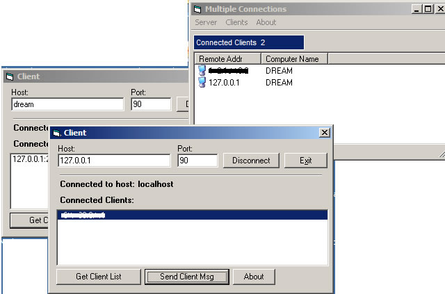



## Multiple Server Connect

### Description

hi, This shows how to create a Multiple Server, that accepts clients, also shows how to check for a freesocket, Send message from server to a client or all clients, close a client or all clients, Know when a client has gone offline, Allows clients to get a list of all clients connected to the server, also Updates the list, if a client goes ofline, anyway hope you like it all code is commented. please vote if you like it.
 
### More Info
 

             |
---                |---
**Submitted On**   |2006-05-02 03:07:32
**By**             |[dreamvb](https://github.com/Planet-Source-Code/PSCIndex/blob/master/ByAuthor/dreamvb.md)
**Level**          |Beginner
**User Rating**    |5.0 (10 globes from 2 users)
**Compatibility**  |VB 6\.0
**Category**       |[Internet/ HTML](https://github.com/Planet-Source-Code/PSCIndex/blob/master/ByCategory/internet-html__1-34.md)
**World**          |[Visual Basic](https://github.com/Planet-Source-Code/PSCIndex/blob/master/ByWorld/visual-basic.md)
**Archive File**   |[Multiple\_S199149522006\.zip](https://github.com/Planet-Source-Code/dreamvb-multiple-server-connect__1-65193/archive/master.zip)

